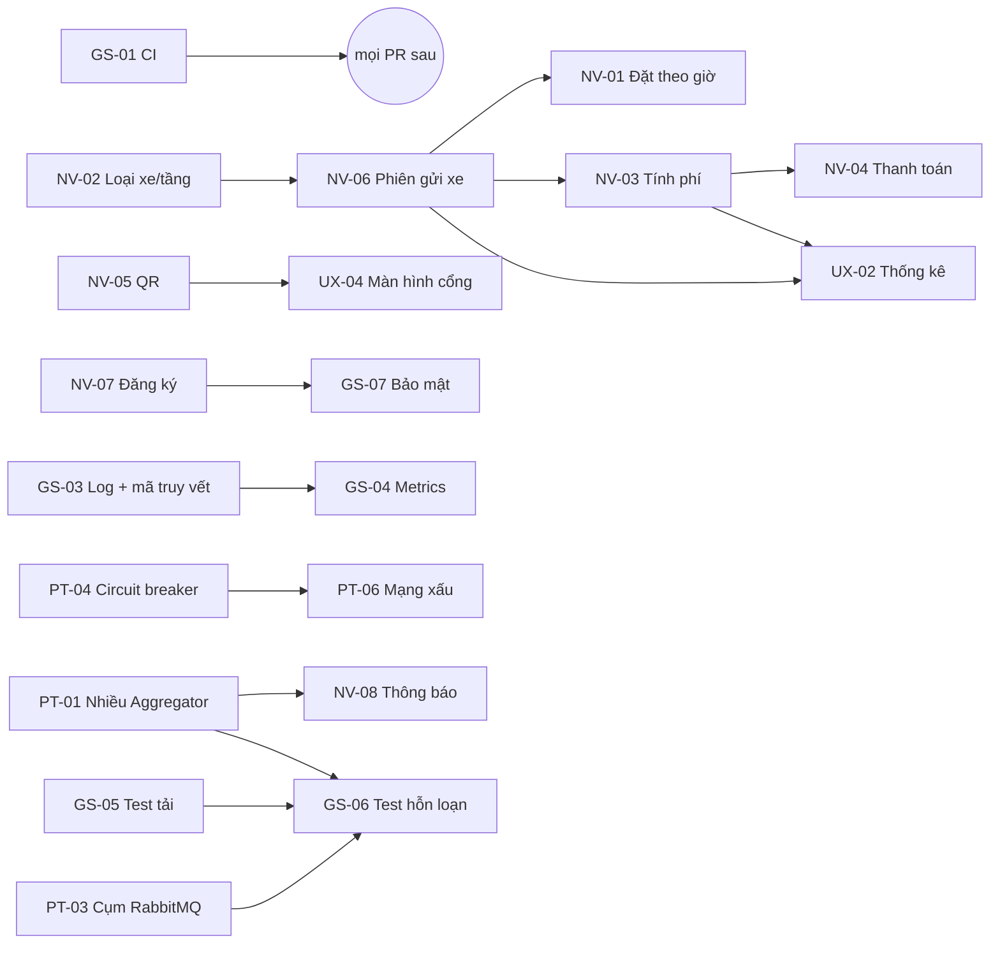

# Kế hoạch chi tiết làm bản hoàn chỉnh – Nhóm 16
**Đề tài:** Bãi đỗ xe thông minh liên kết nhiều bãi · **Môn:** Hệ thống / Ứng dụng phân tán – PTIT
**Lập:** 04/10/2026 · **Người soạn:** Hoàng Văn Huynh · **Repo:** https://github.com/huynhhoang124/nhom16-pt-ung-dung-pt

> File này **mở rộng** `Ke_hoach_phat_trien_ban_hoan_chinh_Nhom16.docx` (danh sách 32 việc). Bản .docx trả lời câu hỏi *làm gì*. File này trả lời *làm thế nào, ai làm, khi nào, kiểm tra ra sao*: sửa file nào, thêm bảng/cột gì, API nào, test nào, demo nói gì.
>
> Cách đọc: mục 1–5 cả nhóm đọc (20 phút). Mục 6 mỗi người đọc phần việc của mình. Mục 7–13 dùng khi làm, demo và bảo vệ.

---

## Mục lục
1. [Hiện trạng và mục tiêu](#1-hiện-trạng-và-mục-tiêu)
2. [Phạm vi: làm gì, không làm gì](#2-phạm-vi-làm-gì-không-làm-gì)
3. [Nguyên tắc kỹ thuật chung](#3-nguyên-tắc-kỹ-thuật-chung)
4. [Phụ thuộc giữa các việc](#4-phụ-thuộc-giữa-các-việc)
5. [Phân công](#5-phân-công)
6. [Đặc tả từng việc](#6-đặc-tả-từng-việc)
7. [Lịch chi tiết theo tuần](#7-lịch-chi-tiết-theo-tuần)
8. [Quy trình Git, PR, CI](#8-quy-trình-git-pr-ci)
9. [Docker Compose bản hoàn chỉnh](#9-docker-compose-bản-hoàn-chỉnh)
10. [Kịch bản demo bản hoàn chỉnh](#10-kịch-bản-demo-bản-hoàn-chỉnh)
11. [Báo cáo, slide, vấn đáp](#11-báo-cáo-slide-vấn-đáp)
12. [Rủi ro và phương án cắt giảm](#12-rủi-ro-và-phương-án-cắt-giảm)
13. [Checklist tổng trước bảo vệ](#13-checklist-tổng-trước-bảo-vệ)

---

## 1. Hiện trạng và mục tiêu

**Đã có (bản cơ bản, đã merge vào `main` qua PR #1):** 3 Parking Node (mỗi bãi 1 Postgres riêng), outbox → RabbitMQ, Aggregator (JWT 3 vai trò, định tuyến, scatter-gather, health check, đối soát, Socket.IO, thêm bãi), frontend React, Docker Compose 11 container, 25 test unit + 9 test e2e đạt. Chi tiết: `ke-hoach-thuc-hien-btl.md` mục 1–2.

**Mục tiêu bản hoàn chỉnh:** một luồng nghiệp vụ trọn vẹn và không còn điểm lỗi đơn quan trọng.

```
Đăng ký → tìm bãi trên bản đồ → đặt chỗ theo khung giờ → nhận QR
→ quét QR vào cổng → gửi xe → tính phí → thanh toán → quét QR ra → lịch sử, thống kê
```

Song song với luồng đó, hệ thống phải chứng minh được khi bảo vệ:
- Tắt **1 Aggregator**, **1 nút RabbitMQ**, **1 bãi**, hoặc làm **mạng chậm** thì hệ thống vẫn chạy.
- Nhân viên vẫn cho xe vào/ra được khi **cả trung tâm sập**.
- Có **số liệu**: test tải (p95, tỉ lệ lỗi), dashboard Grafana, độ trễ sao chép DB.
- Có **CI**: PR nào làm hỏng test thì không merge được.

---

## 2. Phạm vi: làm gì, không làm gì

| Làm | Không làm (ghi vào "Hạn chế" của báo cáo) |
|---|---|
| Thanh toán **giả lập** (nút "Thanh toán", trạng thái PAID) | Cổng thanh toán thật (VNPay/MoMo): cần hợp đồng, không phải trọng tâm môn học |
| QR ký HMAC, quét bằng camera hoặc nhập tay | Nhận diện biển số bằng camera (ALPR) |
| Bản sao DB cho **1 bãi** (bãi A), chuyển đổi **thủ công** | Tự động failover (Patroni, etcd): quá nặng cho máy sinh viên |
| Chạy nhiều bản Aggregator bằng Docker Compose | Kubernetes, cloud |
| Web chạy tốt trên điện thoại | Ứng dụng di động riêng |
| Giao dịch nhiều bãi bằng Saga (nếu kịp) | 2PC/XA |

---

## 3. Nguyên tắc kỹ thuật chung

Mọi việc trong mục 6 đều phải theo các nguyên tắc dưới đây. Reviewer kiểm tra đúng các điểm này.

1. **Mỗi bãi chỉ có một người ghi:** dữ liệu của bãi chỉ do node của bãi đó ghi. Aggregator chỉ chuyển tiếp hoặc đọc cache.
2. **Đổi trạng thái thì phải có sự kiện:** thay đổi nào cần báo ra ngoài thì ghi thêm 1 dòng `parking_events` **trong cùng giao dịch** (dùng hàm `emit` trong `slots.js`). Không publish thẳng lên RabbitMQ từ code nghiệp vụ.
3. **Mọi thao tác ghi người dùng có thể bấm lại đều có `Idempotency-Key`:** đặt chỗ, thanh toán, đặt nhóm (saga).
4. **Thời gian lấy từ đồng hồ DB của bãi** (`now()` trong SQL), không lấy giờ client hay giờ Aggregator. Tính phí, hết hạn, khung giờ đều theo quy tắc này.
5. **Tiền là số nguyên VND** (`INT`), không dùng số thực.
6. **Đổi schema:** sửa thẳng `schema.sql` bằng `CREATE TABLE IF NOT EXISTS` / `ALTER TABLE … ADD COLUMN IF NOT EXISTS`. Không thêm công cụ migration. Đổi kiểu cột hoặc ràng buộc cũ thì ghi trong PR: "cần `docker compose down -v`".
7. **Payload sự kiện chỉ được thêm trường, không đổi/xoá trường cũ** (consumer cũ vẫn chạy được).
8. **Thành phần mới đặt dưới profile của Docker Compose** (mục 9). `docker compose up` mặc định vẫn là bản gọn, máy yếu vẫn chạy được.
9. **Mỗi việc làm trọn một lát dọc:** người nhận việc làm cả API, test và giao diện của tính năng đó. Luân giữ các component dùng chung và review mọi PR frontend.
10. **Comment trong code viết tiếng Việt**, giải thích *vì sao* (lý thuyết nào), giống code hiện tại.

---

## 4. Phụ thuộc giữa các việc



**Đường găng** (trễ là trễ cả dự án): `NV-02 → NV-06 → NV-03 → NV-04` (luồng tiền) và `NV-06 → NV-01` (Hùng). Các việc này phải bắt đầu đúng ngày.

**File nhiều người cùng sửa** (dễ xung đột):

| File | Việc chạm vào | Cách tránh xung đột |
|---|---|---|
| `parking-node/src/schema.sql` | NV-01, 02, 03, 05, 06, 09 | Hùng giữ file; người khác gửi đoạn SQL cho Hùng hoặc PR nhỏ, merge ngay |
| `parking-node/src/slots.js` | NV-01, 06, 09 | Hùng làm cả 3 việc, lần lượt |
| `parking-node/src/app.js` | NV-03, 04, 05, 06, 09, PT-05 | Mỗi việc thêm route vào **file riêng** (`sessions.js`, `gate.js`…), `app.js` chỉ thêm 1 dòng `app.use` |
| `aggregator-service/src/routes.js` | NV-06, 07, PT-01, 04, 07, UX-02 | Tương tự: route mới đặt file riêng |
| `docker-compose.yml` | PT-01, 02, 03, 06, GS-04, NV-08 | Trang giữ file; mỗi việc thêm service dưới profile riêng |

---

## 5. Phân công

**Chốt 05/10:** chỉ **Huynh, Hùng, Luân viết code**. Loan, Trang, Hiệp không code: mỗi người **đi cặp** với một người code để thử tay, đo số liệu, viết lý thuyết và báo cáo cho phần đó, nên khi bảo vệ mỗi phần có 2 người trả lời được.

| Thành viên | Code? | Việc phụ trách | Công (ngày) |
|---|---|---|---|
| **Vũ Văn Hùng** | Có | Node + DB + nghiệp vụ: NV-02, NV-06, NV-03, NV-01, NV-04, NV-09, PT-02 | khoảng 14 |
| **Hoàng Văn Huynh** | Có | Aggregator + hạ tầng + điều phối nhóm: GS-01, PT-04, GS-07, GS-02, PT-01, PT-06, PT-05, PT-03, GS-04 (+ PT-07, GS-06 nếu kịp) | khoảng 14 |
| **Nguyễn Văn Luân** | Có | Giao diện + QR + thông báo: UX-03, NV-07, GS-03, NV-05, UX-01, UX-02, NV-08, GS-05 (+ UX-04 nếu kịp) + review mọi PR giao diện | khoảng 13 |
| **Trịnh Kim Loan** | Không | Cặp với Hùng: bảng giá, dữ liệu mẫu, thử tay, runbook failover, báo cáo mục 5–7 | khoảng 6 |
| **Đỗ Huyền Trang** | Không | Cặp với Huynh: bảng test TC, kịch bản mạng xấu, test tải, dashboard, máy demo, báo cáo mục 8–10 | khoảng 7 |
| **Phạm Sỹ Hiệp** | Không | Cặp với Luân + tài liệu: TL-01 → TL-04, chụp ảnh, thử tay trên điện thoại, ghép báo cáo, slide | khoảng 10 |
| **Cả nhóm** | | TL-05 (tập vấn đáp) | 1/người |

Việc nhỏ của người không code được đánh dấu **[Tên]** trong `danh-sach-viec-nho.md`; phần còn lại của mỗi việc là code.

**Khối lượng:** 3 người code mỗi người khoảng 3,5 ngày/tuần trong 4 tuần. Việc *Nếu kịp* (PT-07, GS-06, UX-04) coi như đã cắt, chỉ làm khi xong sớm.

---

## 6. Đặc tả từng việc

Mỗi việc có: **Ai** · **Cần xong trước** · **Sửa/tạo file** · **DB** · **API** · **Các bước** · **Test** (mã TC tiếp nối TC01–TC14 trong `ap-dung-vao-btl.md`) · **Khi bảo vệ nói gì**.

### 6.1 Nhóm A – Nghiệp vụ sát thực tế

#### NV-02 · Loại xe và tầng · Bắt buộc · 1 ngày
- **Ai:** Hùng · **Cần xong trước:** không.
- **Hiện trạng:** bảng `parking_slots` **đã có** cột `floor`, `type` (mặc định `CAR`), nhưng seed chỉ tạo ô tô một tầng.
- **Sửa:** `parking-node/src/db.js` (seed), `docker-compose.yml` (env), `frontend/src/pages/ParkingDetail.jsx`, `Dashboard.jsx`.
- **DB:** thêm `CHECK (type IN ('CAR','MOTO'))`.
- **Cấu hình:** thay `SLOT_COUNT` bằng `SLOTS="CAR:1:10,CAR:2:10,MOTO:1:40"` (loại:tầng:số lượng). Mã slot dạng `A-1-C01`, `A-1-M01`.
- **API:** `GET /api/availability` trả thêm `byType: {CAR:{available,total}, MOTO:{…}}`. `GET /api/slots?type=CAR`. Aggregator `GET /api/parkings/search?type=CAR&available=true`.
- **Giao diện:** bộ lọc Ô tô / Xe máy; chi tiết bãi nhóm slot theo tầng.
- **Test:** TC15 seed đúng số slot từng loại. TC16 lọc `type=MOTO` chỉ ra xe máy.
- **Nói:** "Cấu hình từng bãi nằm ở chính bãi đó (tự chủ địa phương), Aggregator không cần biết bãi có bao nhiêu tầng."

#### NV-06 · Phiên gửi xe và lịch sử · Bắt buộc · 2 ngày
- **Ai:** Hùng · **Cần xong trước:** NV-02.
- **Sửa:** `schema.sql`, `slots.js` (`moveSlot`), tạo `parking-node/src/sessions.js`; Aggregator tạo `src/sessions-routes.js`; frontend tạo `pages/History.jsx`.
- **DB:**
  ```sql
  CREATE TABLE IF NOT EXISTS parking_sessions (
    id             UUID PRIMARY KEY DEFAULT gen_random_uuid(),
    slot_id        INT NOT NULL REFERENCES parking_slots(id),
    license_plate  VARCHAR(20) NOT NULL,
    reservation_id UUID REFERENCES reservations(id),
    user_id        VARCHAR(64),                 -- có khi xe vào bằng đặt chỗ
    entered_at     TIMESTAMPTZ NOT NULL DEFAULT now(),
    exited_at      TIMESTAMPTZ,
    fee            INT,                         -- VND, tính khi ra (NV-03)
    paid_at        TIMESTAMPTZ,                 -- NV-04
    payment_method VARCHAR(8),                  -- 'ONLINE' | 'CASH'
    payment_key    VARCHAR(128) UNIQUE          -- Idempotency-Key của lần thanh toán
  );
  -- mỗi slot tối đa 1 phiên đang mở, mỗi biển số tối đa 1 phiên đang mở trong bãi này
  CREATE UNIQUE INDEX IF NOT EXISTS ux_open_session_slot  ON parking_sessions(slot_id)       WHERE exited_at IS NULL;
  CREATE UNIQUE INDEX IF NOT EXISTS ux_open_session_plate ON parking_sessions(license_plate) WHERE exited_at IS NULL;
  CREATE INDEX IF NOT EXISTS ix_sessions_plate ON parking_sessions(license_plate, entered_at DESC);
  ```
- **Các bước:**
  1. Trong `moveSlot`, khi `CAR_ENTER`: `INSERT parking_sessions` cùng giao dịch. Biển số bắt buộc khi xe vào.
  2. Khi `CAR_EXIT`: `UPDATE … SET exited_at=now() WHERE slot_id=$1 AND exited_at IS NULL RETURNING *`.
  3. Node: `GET /api/sessions?plate=&from=&to=`.
  4. Aggregator: `GET /api/sessions/search?plate=30A12345` (STAFF/ADMIN) gom song song từ mọi bãi bằng `reg.gather`, trả `{sessions, unavailable:[…]}` giống `/api/me/reservations`. `GET /api/me/sessions` cho USER.
  5. Giao diện: trang "Lịch sử gửi xe" (USER) và ô tra biển số (STAFF/ADMIN).
- **Test:** TC17 vào rồi ra tạo đúng 1 phiên có `exited_at`. TC18 cùng biển số vào lần 2 khi chưa ra thì bị từ chối 409. TC19 tra biển số khi bãi B OFFLINE trả kết quả A, C và `unavailable:["B"]`.
- **Nói:** "Ràng buộc một xe chỉ ở một chỗ chỉ kiểm được **trong một bãi**. Kiểm trên toàn hệ thống phải phối hợp giữa các bãi, mà một bãi mất kết nối thì xe vẫn phải vào được. Nhóm chọn sẵn sàng (cho xe vào) và phát hiện sau bằng tra cứu gom."

#### NV-01 · Đặt chỗ theo khung giờ · Nên có · 4 ngày
- **Ai:** Hùng · **Cần xong trước:** NV-06.
- **Ý tưởng:** đặt chỗ hiện tại = "giữ ngay 15 phút". Bản mới cho chọn **giờ đến + thời lượng**. Một slot có nhiều lượt đặt miễn **không chồng giờ**. Chống chồng giờ bằng ràng buộc của Postgres, không bằng code.
- **DB:**
  ```sql
  CREATE EXTENSION IF NOT EXISTS btree_gist;
  ALTER TABLE reservations ADD COLUMN IF NOT EXISTS end_time TIMESTAMPTZ;   -- hết khung giờ đã đặt
  -- start_time = giờ đến; expire_time = start_time + 15' (quá giờ này chưa đến = no-show)
  ALTER TABLE reservations ADD CONSTRAINT ex_no_overlap EXCLUDE USING gist
    (slot_id WITH =, tstzrange(start_time, end_time) WITH &&) WHERE (status IN ('ACTIVE','USED'));
  ```
  Ràng buộc này **thay** `ux_one_active_per_slot` (xoá index cũ). Thêm `DONE` vào CHECK status: xe ra thì reservation `USED → DONE`, khung giờ được giải phóng. Phải `docker compose down -v`.
- **Logic mới trong `slots.js`:**
  - `reserve` nhận `startTime`, `durationMinutes` (mặc định: bây giờ, 120 phút). Giới hạn: đặt trước tối đa 7 ngày, thời lượng 30 phút – 24 giờ.
  - Đặt **cho tương lai**: chỉ `INSERT` reservation, **không** đổi `parking_slots.status`. Vi phạm `ex_no_overlap` (lỗi `23P01`) thì trả 409 `TIME_CONFLICT`.
  - Đặt **ngay** (start ≤ now + 15'): giữ logic cũ (CAS `AVAILABLE → RESERVED`) **và** INSERT có `end_time`.
  - Job mới `activateDue` (chạy cùng `expireDue` mỗi 30s): reservation ACTIVE có `start_time ≤ now()+15'`, slot đang `AVAILABLE` thì CAS sang `RESERVED` và emit sự kiện. Nếu slot đang `OCCUPIED` (xe trước ở quá giờ) thì **chuyển sang slot trống cùng loại** (UPDATE `slot_id`, ràng buộc EXCLUDE tự kiểm) và emit `RESERVATION_MOVED`. Không còn slot nào thì emit `RESERVATION_CONFLICT` cho nhân viên.
  - `expireDue`: ACTIVE và `expire_time < now()` → `EXPIRED` (no-show).
  - Xe vãng lai vào slot `AVAILABLE`: chỉ cho nếu slot không có reservation bắt đầu trong 2 giờ tới. Nếu có thì trả 409 kèm gợi ý slot khác.
- **API:** `POST /api/parkings/:id/reservations` thêm `startTime`, `durationMinutes`. `GET /api/parkings/:id/slots/:code/schedule?date=` trả các khung đã đặt.
- **Giao diện:** chọn ngày giờ bằng `<input type="datetime-local">` và thời lượng, xem lịch slot dạng thanh ngang.
- **Test:** TC20 hai khung chồng nhau cùng slot thì cái sau 409 (e2e, Postgres thật). TC21 hai khung nối tiếp (10–12, 12–14) đều thành công (`[)` nửa mở). TC22 đến giờ thì `activateDue` chuyển slot sang RESERVED. TC23 slot bị chiếm thì reservation được chuyển slot.
  > PGlite (test unit) cần nạp extension `btree_gist` (`@electric-sql/pglite/contrib/btree_gist`). Thử ngay ngày đầu; nếu không được thì TC20–21 chỉ chạy ở e2e.
- **Nói:** "Chống đặt trùng chuyển từ 'một trạng thái' sang 'khoảng thời gian không giao nhau'. Vẫn là ràng buộc trong **một DB**, nên vẫn không cần 2PC."

#### NV-03 · Tính phí gửi xe · Bắt buộc · 2 ngày
- **Ai:** Hùng · **Cần xong trước:** NV-06.
- **Tạo:** `parking-node/src/pricing.js` (hàm thuần, không đụng DB), `parking-node/test/pricing.test.js`.
- **DB:**
  ```sql
  CREATE TABLE IF NOT EXISTS pricing_rules (
    vehicle_type   VARCHAR(8) PRIMARY KEY,      -- CAR | MOTO
    first_block_min INT NOT NULL,               -- vd 120 phút đầu
    first_block_fee INT NOT NULL,               -- vd 25000
    next_hour_fee   INT NOT NULL,               -- mỗi giờ tiếp theo (chưa đủ giờ tính tròn 1 giờ)
    overnight_fee   INT NOT NULL,               -- phụ thu nếu phiên chạm khung 22:00–06:00
    max_day_fee     INT                         -- trần mỗi 24 giờ, NULL = không trần
  );
  ```
  Seed giá mặc định khác nhau giữa các bãi qua env `PRICING` (vd bãi C ở trung tâm đắt hơn).
- **Hàm:** `calcFee(rule, enteredAt, exitedAt)` trả về `{fee, breakdown:[…]}`. Tính theo giờ Việt Nam (`Asia/Ho_Chi_Minh`) để biết có qua đêm không.
- **Gắn vào luồng:** khi `CAR_EXIT`, tính `fee` và ghi vào phiên **trong cùng giao dịch**. API trả phí để giao diện nhân viên hiện. `GET /api/sessions/:id/quote` cho xem phí tạm tính khi xe chưa ra.
- **API quản lý:** `GET/PUT /api/parkings/:id/pricing` (STAFF bãi đó, ADMIN).
- **Test:** TC24 bảng biên: 0 phút, đúng 120 phút, 121 phút, qua 22:00, qua 2 đêm, chạm trần ngày. TC25 xe ra thì phiên có `fee` đúng.
- **Nói:** "Bảng giá thuộc về từng bãi, đổi giá bãi C không ảnh hưởng A, B. Giờ tính phí lấy theo đồng hồ DB của bãi, không theo máy khách."

#### NV-04 · Thanh toán giả lập · Nên có · 2 ngày
- **Ai:** Hùng · **Cần xong trước:** NV-03.
- **Dùng lại** các cột `paid_at`, `payment_method`, `payment_key` của `parking_sessions` (không tạo bảng hoá đơn riêng).
- **API node:** `POST /api/sessions/:id/pay {method}`, header `Idempotency-Key`:
  ```sql
  UPDATE parking_sessions SET paid_at=now(), payment_method=$2, payment_key=$3,
         fee = COALESCE(fee, <phí tạm tính>)
  WHERE id=$1 AND paid_at IS NULL RETURNING *;
  ```
  Không có dòng nào bị đổi mà `payment_key` trùng key cũ thì trả lại kết quả cũ (bấm lại không trả tiền lần 2). Emit `SESSION_PAID`.
- **Luồng:** người dùng trả trước khi ra (ONLINE) hoặc nhân viên thu tiền mặt lúc ra (CASH). Xe chỉ được `exit` khi phiên đã PAID, hoặc nhân viên chọn "Thu tiền mặt và cho ra" (pay + exit trong một giao dịch).
- **Aggregator:** `POST /api/me/sessions/:parkingId/:sid/pay` chuyển tiếp cùng key, timeout trả 504 giống đặt chỗ.
- **Giao diện:** nút "Thanh toán" ở Lịch sử gửi xe; trạng thái CHƯA TRẢ / ĐÃ TRẢ; nút "Thử lại" dùng cùng key.
- **Test:** TC26 trả 2 lần cùng key thì chỉ 1 lần ghi nhận. TC27 hai request trả song song khác key thì đúng 1 thành công (e2e). TC28 chưa trả thì exit bị 402 `PAYMENT_REQUIRED`.
- **Nói:** "Đây chính là bài toán chuyển tiền: timeout không biết tiền đã trừ chưa. Idempotency-Key cộng UPDATE có điều kiện thì thanh toán chạy *đúng một lần* theo hiệu quả."

#### NV-05 · Mã QR vào/ra · Nên có · 2 ngày
- **Ai:** Luân · **Cần xong trước:** không (NV-06 thì tốt hơn).
- **Tạo:** `parking-node/src/qr.js`, `parking-node/src/gate.js`. Thêm option `--qr` cho `scripts/barrier.mjs`.
- **Token:** `base64url(JSON {p: parkingId, r: reservationId, e: hếtHạn}) + "." + base64url(HMAC_SHA256(QR_SECRET, phầnĐầu))`. Mỗi bãi có `QR_SECRET` riêng (env). Dùng `crypto` có sẵn của Node, so chữ ký bằng `crypto.timingSafeEqual`.
- **Luồng:** node ký token **ngay khi đặt chỗ** (nó giữ khoá) và trả trong response. Aggregator chỉ chuyển tiếp. Quét ở cổng gọi thẳng node: `POST /api/gate/scan {token, action:'enter'|'exit'}`. Node tự xác thực chữ ký, hạn, `p` đúng bãi mình, reservation còn ACTIVE, rồi gọi `moveSlot` như cũ.
- **Giao diện:** hiện QR ở "Đặt chỗ của tôi" (thư viện `qrcode`, vài KB).
- **Test:** TC29 token đúng thì vào được. TC30 sửa 1 ký tự thì 401. TC31 token bãi A quét ở bãi B thì 403. TC32 quét lại token đã dùng thì 409.
- **Nói:** "Cổng xác thực **cục bộ**, không cần hỏi Aggregator. Trung tâm sập thì xe vẫn vào bằng QR được: tính tự chủ của site."

#### NV-07 · Đăng ký tài khoản · Bắt buộc · 1 ngày
- **Ai:** Luân · **Cần xong trước:** không.
- **Sửa:** `aggregator-service/src/auth.js`, `routes.js`; tạo `frontend/src/pages/Register.jsx`.
- **API:** `POST /api/auth/register {username, password}`: chỉ tạo vai trò USER. Username `^[a-z0-9_.]{4,32}$`, mật khẩu ≥ 8 ký tự, băm bcrypt (đã có `bcryptjs`). Trùng tên thì 409 (dựa vào `UNIQUE` của DB, không SELECT trước). `PUT /api/me/password {oldPassword, newPassword}`.
- **Giới hạn thử:** một `Map` trong RAM, sai 5 lần trong 15 phút theo `username+IP` thì 429. (`// ponytail: đếm trong RAM từng bản Aggregator; nhiều bản thì giới hạn thực tế x N, cần chung thì dùng bảng DB`)
- **Test:** TC33 đăng ký rồi đăng nhập được. TC34 trùng tên 409. TC35 sai mật khẩu lần thứ 6 thì 429.

#### NV-08 · Dịch vụ thông báo · Nên có · 2 ngày
- **Ai:** Luân · **Cần xong trước:** PT-01 (nhiều Aggregator cùng nhận được thông báo).
- **Tạo:** thư mục `notification-service/` (Node, `amqplib`, khoảng 100 dòng), Dockerfile, service trong compose.
- **Luồng:**
  ```
  Node (job mỗi 30s): reservation sắp hết giữ chỗ trong 5' và chưa báo → emit RESERVATION_EXPIRING (cột warned_at chống báo lặp)
  Node: mọi sự kiện slot kèm thêm available/total của bãi
        │ RabbitMQ parking.events
        ▼
  notification-service (queue notification.events): lọc, soạn nội dung tiếng Việt
     - RESERVATION_EXPIRING / EXPIRED / MOVED / CONFLICT → gửi riêng người dùng (userId trong payload)
     - available/total < 10% → "Bãi B sắp đầy" cho mọi người (báo 1 lần, chỉ báo lại khi đã lên > 20%)
        │ exchange user.notifications (topic: user.<id> | broadcast)
        ▼
  Mỗi Aggregator (queue riêng) → Socket.IO room "user:<id>" hoặc toàn bộ → toast trên web
  ```
- **Cần sửa thêm:** payload sự kiện reservation có `userId`, `reservationId`. Socket.IO xác thực JWT lúc kết nối (`socket.handshake.auth.token`) rồi `join('user:'+sub)`.
- **Test:** TC36 đặt chỗ với `RESERVATION_MINUTES=6` thì 1 phút sau nhận thông báo sắp hết hạn. TC37 tắt notification-service thì đặt chỗ vẫn chạy; bật lại thì nhận thông báo còn tồn trong queue.
- **Nói:** "Thêm một bên nhận sự kiện mà **không sửa node**: lợi ích của pub/sub, các bên tách rời nhau."

#### NV-09 · Quản lý slot · Nên có · 1 ngày
- **Ai:** Hùng · **Cần xong trước:** NV-02.
- **DB:** `ALTER TABLE parking_slots ADD COLUMN IF NOT EXISTS hidden_at TIMESTAMPTZ;` mọi truy vấn danh sách thêm `WHERE hidden_at IS NULL`.
- **API node + Aggregator (STAFF bãi đó, ADMIN):** `POST /slots {slotCode, floor, type}`, `PATCH /slots/:code {floor, type}`, `DELETE /slots/:code` (ẩn). Ẩn bằng một câu:
  ```sql
  UPDATE parking_slots SET hidden_at=now(), version=version+1
  WHERE slot_code=$1 AND status IN ('AVAILABLE','MAINTENANCE') AND hidden_at IS NULL
    AND NOT EXISTS (SELECT 1 FROM reservations WHERE slot_id=parking_slots.id AND status='ACTIVE')
  ```
  Emit `SLOT_ADDED` / `SLOT_HIDDEN` (status `HIDDEN`) để cache Aggregator cập nhật.
- **Test:** TC38 ẩn slot đang có xe thì 409. TC39 thêm slot thì trang tổng quan tăng tổng số chỗ (realtime).

### 6.2 Nhóm B – Phân tán nâng cao

#### PT-04 · Circuit breaker + retry · Bắt buộc · 1,5 ngày
- **Ai:** Huynh · **Cần xong trước:** không.
- **Sửa:** `aggregator-service/src/nodes.js`. **Tận dụng** `n.fails` và `n.status` đã có, không thêm thư viện:
  - Request thường lỗi (timeout, 5xx, mất kết nối) cũng tăng `n.fails`. Đủ `failThreshold` thì `OFFLINE` ngay (**mạch mở**): request sau bị từ chối tức thì, không chờ timeout.
  - Health check mỗi 5s đóng vai **nửa mở**: thử 1 lần, thành công thì `ONLINE` (đóng mạch) và đối soát.
  - Retry 1 lần, chờ 100–300 ms ngẫu nhiên (jitter), **chỉ** cho: GET, đặt chỗ, thanh toán (có Idempotency-Key). **Không** retry xe vào/ra, khoá slot (không idempotent).
  - Retry phải nằm trong tổng ngân sách thời gian `reserveTimeoutMs`.
- **Test:** TC40 node giả lỗi 3 lần liên tiếp thì request thứ 4 bị 503 ngay (< 50 ms). TC41 node giả lỗi 1 lần rồi tốt thì GET vẫn thành công nhờ retry. TC42 `enter` lỗi thì không retry (node giả đếm đúng 1 lần gọi).
- **Nói:** "Retry chỉ an toàn khi thao tác idempotent. Đó là lý do đặt chỗ có key còn xe vào/ra thì không tự retry."

#### PT-01 · Nhiều bản Aggregator + cân bằng tải · Bắt buộc · 3 ngày
- **Ai:** Huynh · **Cần xong trước:** GS-03 nên có (để thấy request đi vào bản nào).
- **Thiết kế:**
  - Compose: `aggregator-1`, `aggregator-2` (profile `ha`; mặc định vẫn 1 bản tên `aggregator`). Mỗi bản có env `INSTANCE_ID`.
  - **Cân bằng tải bằng nginx đã có trong `frontend/`** (không thêm Traefik): `upstream aggregators { server aggregator-1:8000 resolve; server aggregator-2:8000 resolve; }` + `proxy_next_upstream error timeout http_502 http_503`. Tham số `resolve` cần nginx ≥ 1.27.3; `frontend/Dockerfile` đang dùng `nginx:1.27-alpine`, nên ghim hẳn `nginx:1.29-alpine` cho chắc.
  - **Realtime không cần Redis adapter:** mỗi bản có **queue RabbitMQ riêng** `aggregator.slot-updates.<INSTANCE_ID>` (durable) cùng bind vào `parking.events`. Sự kiện tới mọi bản, mỗi bản đẩy cho client đang nối với nó. Client Socket.IO đặt `transports: ['websocket']` để khỏi cần sticky session.
  - **Đồng bộ danh sách bãi:** mỗi lần health check (5s) đọc lại `parking_nodes` từ DB, nên admin thêm bãi ở bản 1 thì bản 2 cũng thấy.
  - JWT dùng chung secret (hoặc khoá RS256 ở PT-05), nên đăng nhập ở bản nào cũng dùng được ở bản kia.
  - Response có header `X-Instance` để demo thấy request đi vào bản nào.
- **Lưu ý:** đổi tên queue thì queue cũ `aggregator.slot-updates` thừa; xoá trên giao diện RabbitMQ hoặc `down -v`.
- **Test:** TC43 (e2e) tắt `aggregator-1` giữa chừng, 20 request tra cứu liên tiếp đều 200. TC44 client nối vào bản 2 vẫn nhận `SLOT_UPDATED` khi thao tác qua bản 1.
- **Nói:** "Aggregator **không giữ trạng thái gốc** (stateless; cache dựng lại được từ sự kiện + đối soát) nên nhân bản rất dễ. Cái khó nằm ở dữ liệu, và dữ liệu đã nằm ở bãi."

#### PT-05 · Nhân viên làm việc khi Aggregator sập · Nên có · 2 ngày
- **Ai:** Huynh · **Cần xong trước:** không (nên làm sau PT-01).
- **Thiết kế:**
  - Aggregator ký JWT bằng **RS256** (khoá riêng). Các node giữ **khoá công khai** (env `JWT_PUBLIC_KEY`), tự kiểm token mà không cần gọi Aggregator. Script `scripts/gen-keys.mjs` sinh cặp khoá bằng `crypto.generateKeyPairSync` rồi ghi vào `.env`.
  - Node thêm nhóm route `/staff-api/slots/:code/:action`, `/staff-api/slots`: nhận `Authorization: Bearer`, chỉ chấp nhận `role=STAFF && parkingId=<bãi này>` hoặc `ADMIN`. Bật CORS cho origin của frontend.
  - Frontend: trang nhân viên gọi Aggregator như cũ; gặp lỗi mạng/5xx thì chuyển sang gọi thẳng `publicUrl` của bãi (lấy từ `/api/parkings`, lưu `localStorage`). Hiện băng vàng "Đang làm việc trực tiếp với bãi A (trung tâm mất kết nối)".
- **Test:** TC45 token STAFF bãi A gọi thẳng node A thì 200, gọi node B thì 403. TC46 (e2e) dừng mọi Aggregator, nhân viên vẫn cho xe vào/ra; bật lại thì cache khớp sau đối soát.
- **Nói:** "Khắc phục hạn chế đã ghi trong HLD. Xác thực phân tán bằng chữ ký số: node kiểm token **cục bộ**. Đổi lại, thu hồi token khó hơn, nên token chỉ sống 8 giờ."

#### PT-06 · Giả lập mạng xấu · Bắt buộc · 2 ngày
- **Ai:** Huynh · **Cần xong trước:** PT-04 (để thấy breaker hoạt động).
- **Thiết kế:** service `toxiproxy` (image `ghcr.io/shopify/toxiproxy`, profile `chaos`) đứng giữa Aggregator và bãi B: proxy `parking-b` nghe `:18002`, chuyển tới `parking-b:8002`. File `docker-compose.chaos.yml` đổi `apiUrl` của bãi B sang `http://toxiproxy:18002`. Script `scripts/net.mjs` gọi HTTP API của toxiproxy (cổng 8474):
  ```bash
  node scripts/net.mjs B latency 1500     # chậm nhưng dưới timeout
  node scripts/net.mjs B latency 3500     # vượt timeout ghi -> 504, thử lại cùng key -> 200 replay
  node scripts/net.mjs B down             # cắt mạng Aggregator–B, B vẫn sống và barrier vẫn chạy
  node scripts/net.mjs B loss 30          # 30% kết nối bị cắt ngang
  node scripts/net.mjs B reset            # gỡ hết
  ```
- **Kịch bản ghi lại (ảnh/số liệu cho báo cáo):** (1) chậm 1,5s; (2) chậm 3,5s khi đặt chỗ: 504 rồi retry thành công, DB chỉ 1 reservation; (3) cắt mạng: B OFFLINE sau khoảng 15s nhưng barrier vẫn cho xe vào B, nối lại thì đối soát khớp; (4) chập chờn: breaker mở/đóng.
- **Test:** TC47 (e2e, profile chaos) kịch bản (2) tự động.
- **Nói:** "Phân vùng mạng khác node chết: B vẫn sống, vẫn nhận xe từ barrier. Vì mỗi bãi chỉ có một người ghi nên không có xung đột khi nối lại, đối soát là đủ."

#### PT-03 · Cụm RabbitMQ 3 nút + quorum queue · Nên có · 2 ngày
- **Ai:** Huynh · **Cần xong trước:** không.
- **Thiết kế:**
  - `rabbitmq-1/2/3` (profile `ha`) cùng `RABBITMQ_ERLANG_COOKIE`, `hostname` cố định, file `rabbitmq/rabbitmq.conf` dùng `cluster_formation.peer_discovery_backend = classic_config` liệt kê 3 nút.
  - Queue khai báo `arguments: {'x-queue-type': 'quorum'}`. Không khai báo lại được queue classic cùng tên, phải `down -v` một lần.
  - Client (`relay.js`, `events.js`, notification) đọc `RABBITMQ_URLS` (danh sách, cách nhau dấu phẩy), lần lượt thử từng địa chỉ khi kết nối lại.
- **Test:** TC48 tắt nút đang có kết nối thì relay/consumer chuyển nút khác trong < 10s, không mất sự kiện (đếm `published_at IS NULL` về 0 và cache khớp). TC49 tắt 2/3 nút thì queue ngừng (mất đa số); outbox giữ tin; bật lại thì gửi hết.
- **Nói:** "Quorum queue dùng thuật toán **Raft**: ghi khi đa số (2/3) xác nhận. Mất đa số thì dừng để không sai, tin vẫn an toàn trong outbox. Hai cơ chế bổ sung cho nhau."

#### PT-02 · Bản sao DB bãi A · Nên có · 3 ngày
- **Ai:** Hùng · **Cần xong trước:** không.
- **Thiết kế:**
  - `db-a` thêm `command: postgres -c wal_level=replica -c max_wal_senders=5`, script `postgres/init-primary.sh` tạo user `replicator` + dòng `pg_hba.conf`.
  - `db-a-replica` (profile `ha`, image `postgres:16-alpine`): entrypoint chạy `pg_basebackup -h db-a -U replicator -D $PGDATA -R -X stream` nếu thư mục dữ liệu rỗng, rồi chạy postgres (chế độ standby).
  - Node A thêm `READ_DATABASE_URL`: các truy vấn **chỉ đọc không quan trọng** (danh sách slot, thống kê, lịch sử) đọc replica; **mọi ghi và mọi đọc trong luồng ghi** dùng primary. Không có biến này thì dùng primary như cũ.
  - Độ trễ sao chép: `SELECT EXTRACT(EPOCH FROM now() - pg_last_xact_replay_timestamp())` trên replica, đưa vào metric (GS-04).
  - **Quy trình failover thủ công** (`tai-lieu/runbook-failover.md`): dừng `db-a` → `SELECT pg_promote()` trên replica → đổi `DATABASE_URL` của parking-a → restart. **Không** bật lại db-a cũ làm primary (hai primary = split brain), phải dựng lại làm replica.
- **Test/đo:** TC50 ghi ở primary, đọc replica thấy sau < 1s (đo 100 lần, ghi trung bình/p95). TC51 dừng replica thì node A vẫn chạy (đọc rơi về primary).
- **Nói:** "Sao chép **bất đồng bộ**: nhanh nhưng nếu primary chết, vài giao dịch cuối có thể chưa sang replica. Bật `synchronous_commit` thì không mất nhưng chậm, và replica chết thì ghi bị treo: lại là đánh đổi C và A. Còn có vấn đề *đọc lại thứ mình vừa ghi*: vừa đặt chỗ xong đọc replica có thể chưa thấy. Vì vậy đọc trong luồng ghi luôn dùng primary."

#### PT-07 · Saga đặt chỗ nhiều bãi · Nếu kịp · 3 ngày
- **Ai:** Huynh · **Cần xong trước:** PT-04.
- **DB Aggregator:**
  ```sql
  CREATE TABLE IF NOT EXISTS sagas (
    id         UUID PRIMARY KEY DEFAULT gen_random_uuid(),
    request_id VARCHAR(128) UNIQUE NOT NULL,     -- userId:Idempotency-Key
    status     VARCHAR(14) NOT NULL,             -- RUNNING | COMPLETED | COMPENSATING | FAILED
    steps      JSONB NOT NULL,                   -- [{parkingId, slotCode, plate, reservationId?, state}]
    updated_at TIMESTAMPTZ NOT NULL DEFAULT now()
  );
  ```
- **Luồng:** `POST /api/group-reservations {items:[…]}`. Đặt **lần lượt** từng bãi, key bước = `<sagaId>:<i>`; **ghi trạng thái saga sau mỗi bước**. Một bước lỗi thì chuyển `COMPENSATING` và huỷ ngược các bước đã xong (`DELETE reservation`, 404 = đã huỷ = coi là xong). Aggregator khởi động lại thì quét saga `RUNNING/COMPENSATING` và bù trừ tiếp.
- **Test:** TC52 đặt A + B khi B OFFLINE thì chỗ ở A được trả lại, saga `FAILED`. TC53 kill Aggregator giữa saga, bật lại thì saga được bù trừ xong.
- **Nói:** "Giao dịch xuyên nhiều DB mà không 2PC: chấp nhận trạng thái trung gian thấy được (chỗ A bị giữ vài trăm ms), đổi lại không bị khoá khi một bên chết."

### 6.3 Nhóm C – Giám sát và chất lượng

#### GS-01 · CI GitHub Actions · Bắt buộc · 0,5 ngày
- **Ai:** Huynh · **Làm đầu tiên**, trước mọi việc khác.
- **Tạo:** `.github/workflows/ci.yml`: chạy khi push/PR vào `dev`, `main`. Job matrix 2 thư mục `parking-node`, `aggregator-service` (Node 20: `npm ci && npm test`; aggregator cần `npm ci` của parking-node trước) + job build `frontend` (`npm ci && npm run build`).
- **Sau khi chạy xanh:** Huynh bật branch protection cho `dev` và `main`: bắt buộc check `ci` xanh.
- **Kiểm:** tạo PR cố tình làm hỏng 1 test thì CI đỏ, không merge được.

#### GS-02 · Test e2e trong CI · Nên có · 1 ngày
- **Ai:** Huynh · **Cần xong trước:** GS-01.
- Job `e2e`: `docker compose up -d --build --wait` → `node --test tests/e2e.test.mjs` → luôn chạy `docker compose logs` khi lỗi và `docker compose down -v`. Chỉ chạy khi PR vào `main` hoặc gắn nhãn `e2e` (khoảng 5 phút).

#### GS-03 · Log có cấu trúc + mã truy vết · Nên có · 1,5 ngày
- **Ai:** Luân · **Cần xong trước:** không.
- **Thiết kế** (không thêm thư viện):
  - Mỗi service có `src/log.js` khoảng 15 dòng: `log.info(msg, fields)` in **1 dòng JSON** `{ts, level, service, requestId, msg, …}`.
  - `AsyncLocalStorage` (có sẵn trong Node) giữ `requestId` trong suốt một request.
  - Aggregator: lấy `X-Request-Id` từ nginx (`proxy_set_header X-Request-Id $request_id`) hoặc tự sinh `crypto.randomUUID()`, gửi tiếp sang node.
  - Node: ghi `requestId` vào payload sự kiện. Relay đặt `correlationId` của bản tin AMQP. Consumer log lại.
  - Response trả header `X-Request-Id` (hiện ở DevTools).
- **Kiểm:** `docker compose logs | grep <requestId>` thấy đủ: nginx → aggregator → parking-b → relay → aggregator consumer.
- **Nói:** "Hệ phân tán không có một stack trace chung; mã truy vết nối các mảnh log lại thành một câu chuyện."

#### GS-04 · Metrics + dashboard · Nên có · 3 ngày
- **Ai:** Huynh · **Cần xong trước:** GS-03 (nên có).
- **Thiết kế** (profile `obs`):
  - Node và Aggregator dùng thư viện `prom-client`, mở `GET /metrics`:
    - `http_request_duration_seconds` (histogram; nhãn route, method, code)
    - `outbox_unpublished` (gauge, `SELECT count(*) … WHERE published_at IS NULL`)
    - `parking_available_slots{type}` (node)
    - `parking_node_up{parking}`, `circuit_open{parking}` (Aggregator)
    - `replication_lag_seconds` (node A khi có replica)
  - RabbitMQ: plugin `rabbitmq_prometheus` (cổng 15692) cho độ dài queue và tốc độ tin.
  - `observability/prometheus.yml`, Grafana (cổng 3001) với datasource + dashboard JSON nạp sẵn qua provisioning (`observability/grafana/`), không phải click tay.
- **Dashboard 1 trang (dùng khi demo):** trạng thái 3 bãi · request/s · p95 · outbox chưa gửi · độ dài queue · chỗ trống từng bãi · độ trễ replica.
- **Kiểm:** tắt RabbitMQ thì thấy `outbox_unpublished` tăng dần; bật lại thì về 0.

#### GS-05 · Test tải · Nên có · 1,5 ngày
- **Ai:** Luân · **Cần xong trước:** không (nên sau GS-04 để chụp dashboard).
- **Công cụ:** k6 chạy bằng Docker, không cần cài: `docker run --rm -i --network nhom16-parking_default grafana/k6 run - < tests/load/k6.js`.
- **Kịch bản:** (1) 200 người dùng ảo tra cứu `/api/parkings/availability` trong 2 phút; (2) 50 người dùng ảo đặt chỗ ngẫu nhiên vào **cùng 10 slot** (tranh chấp cao), mỗi lần key mới; (3) chạy (1) + (2) khi có 1 và 2 bản Aggregator.
- **Kiểm sau test (bất biến):** truy vấn từng DB bãi: không slot nào có > 1 reservation ACTIVE; không có 5xx ngoài 503/504 có chủ đích.
- **Ghi vào báo cáo:** bảng p50/p95/p99, request/s, tỉ lệ lỗi; so sánh 1 bản và 2 bản Aggregator; ảnh dashboard lúc chạy tải.

#### GS-06 · Test hỗn loạn tự động · Nếu kịp · 2 ngày
- **Ai:** Huynh · **Cần xong trước:** GS-05, PT-01, PT-03.
- **Tạo:** `tests/chaos.mjs`: chạy tải nền (GS-05) 3 phút; cứ 15–30 giây tắt/bật ngẫu nhiên một trong `parking-b`, `rabbitmq-2`, `aggregator-1`. Hết giờ thì bật lại tất cả, chờ 30s rồi kiểm 4 bất biến:
  1. Không slot nào có 2 reservation ACTIVE (hoặc chồng giờ).
  2. `parking_events` chưa gửi = 0 ở mọi bãi.
  3. Cache Aggregator == `GET /api/slots` của từng node (đối soát hội tụ).
  4. Mỗi `Idempotency-Key` ứng với tối đa 1 reservation.
- **Nói:** "Không chứng minh được hệ chạy đúng bằng vài lần bấm tay; test hỗn loạn kiểm các **bất biến** dưới lỗi ngẫu nhiên."

#### GS-07 · Bảo mật cơ bản · Bắt buộc · 1 ngày
- **Ai:** Huynh · **Cần xong trước:** NV-07 (dùng chung bộ đếm giới hạn thử).
- **Việc:**
  - `.env.example` đưa lên git, `.env` cho vào `.gitignore`. Compose dùng `${JWT_SECRET:?thiếu JWT_SECRET}`, bỏ giá trị mặc định `dev` cho khoá bí mật (riêng mật khẩu demo vẫn giữ).
  - Kiểm đầu vào: biển số theo mẫu VN (vd `^[0-9]{2}[A-Z]{1,2}[0-9]?-?[0-9]{3}\.?[0-9]{2}$`, chuẩn hoá chữ hoa, bỏ dấu cách), `slotCode`, độ dài chuỗi, `express.json({limit:'10kb'})`.
  - Header bảo mật đặt trong `frontend/nginx.conf` bằng `add_header` (X-Content-Type-Options, X-Frame-Options, Referrer-Policy, Content-Security-Policy cơ bản). Không thêm thư viện helmet.
  - Node chỉ mở cổng ra ngoài khi cần (barrier/PT-05); khoá `INTERNAL_KEY` mạnh.
- **Test:** TC54 biển số sai định dạng thì 400. TC55 thiếu `JWT_SECRET` thì compose báo lỗi, không chạy.

### 6.4 Nhóm D – Trải nghiệm người dùng

#### UX-03 · Hoàn thiện giao diện · Bắt buộc · 2 ngày (làm sớm)
- **Ai:** Luân · **Làm ở tuần 1** vì là nền cho giao diện của mọi việc khác.
- **Việc:** component dùng chung `Toast`, `Loading`, `ErrorBox`, `Badge` (ONLINE/OFFLINE/stale), `ConfirmButton`; `api.js` xử lý lỗi thống nhất (401 thì về trang đăng nhập; 503/504 thì thông báo dễ hiểu); bố cục mobile-first (kiểm ở 375px); thống nhất câu chữ tiếng Việt; logo + màu nhóm; menu theo vai trò.
- **Kiểm:** mọi trang dùng được trên điện thoại thật; không còn lỗi hiện dạng JSON thô.

#### UX-01 · Bản đồ + tìm bãi gần nhất · Nên có · 2 ngày
- **Ai:** Luân.
- **DB Aggregator:** `ALTER TABLE parking_nodes ADD COLUMN IF NOT EXISTS lat DOUBLE PRECISION, ADD COLUMN IF NOT EXISTS lng DOUBLE PRECISION;` thêm toạ độ thật cho A, B, C vào `NODES` và form thêm bãi.
- **Frontend:** thư viện `leaflet` + `react-leaflet`, nền OpenStreetMap. Vị trí người dùng lấy bằng `navigator.geolocation`. Khoảng cách tính bằng công thức haversine (5 dòng). Sắp xếp theo khoảng cách, bỏ bãi hết chỗ hoặc OFFLINE. Màu marker theo % chỗ trống, đổi realtime theo sự kiện.
- **Kiểm:** từ chối quyền vị trí thì vẫn hiện bản đồ Hà Nội và danh sách theo tên.

#### UX-02 · Thống kê cho quản trị · Nên có · 3 ngày
- **Ai:** Luân · **Cần xong trước:** NV-03, NV-06.
- **API node:** `GET /api/stats?from=&to=` gồm lượt vào theo giờ (24 số), số phiên, doanh thu, thời gian gửi trung bình, tỉ lệ lấp đầy hiện tại. Đọc từ replica nếu có (PT-02).
- **Aggregator:** `GET /api/admin/stats` gom song song, cộng dồn, trả kèm `unavailable:[…]`; giao diện ghi rõ "Số liệu thiếu bãi B".
- **Frontend:** trang Thống kê (ADMIN; STAFF chỉ thấy bãi mình). Biểu đồ cột vẽ bằng CSS/SVG đơn giản, chỉ thêm thư viện biểu đồ nếu thật sự cần.
- **Nói:** "Truy vấn phân tán: gom từ nhiều DB, chấp nhận kết quả một phần và **nói rõ là một phần**."

#### UX-04 · Màn hình cổng bãi · Nếu kịp · 2 ngày
- **Ai:** Luân · **Cần xong trước:** NV-05.
- **Frontend:** trang `/gate/:parkingId` cho máy tính bảng: nút lớn Xe vào / Xe ra; quét QR bằng camera (`BarcodeDetector` nếu trình duyệt hỗ trợ, nếu không thì thư viện `html5-qrcode`); luôn có ô nhập mã tay. Gọi thẳng node của bãi (như PT-05), không qua Aggregator.

### 6.5 Nhóm E – Tài liệu và bảo vệ

| Mã | Ai | Việc cụ thể | Hạn |
|---|---|---|---|
| TL-01 | Hiệp | Sửa đủ 6 mục "Cần sửa" ở `README.md` trong HLD và kế hoạch PDF; xuất lại PDF; tick checklist | 12/10 |
| TL-02 | Hiệp | Vẽ lại sơ đồ draw.io (giữ kiểu vẽ tay của nhóm): nginx LB → 2 Aggregator; cụm RabbitMQ 3 nút; DB A + replica; notification-service; Prometheus/Grafana; toxiproxy (nét đứt, chỉ khi demo). Xuất PNG/SVG vào `so-do/` | 26/10 |
| TL-03 | Hiệp ghép, mỗi người viết phần mình | Báo cáo theo dàn ở mục 11.1; mỗi người nộp phần của mình (1–3 trang + ảnh) cho Hiệp | nháp 02/11, xong 07/11 |
| TL-04 | Hiệp + Huynh | Slide khoảng 15 trang (mục 11.2) + kịch bản demo (mục 10) | 07/11 |
| TL-05 | Cả nhóm | Mỗi người trả lời được câu hỏi về việc mình làm (dòng "Nói" ở mục 6) + 10 câu chung + câu mới ở mục 11.3 | 09/11 |

---

## 7. Lịch chi tiết theo tuần

> Có chỉnh so với bản .docx: GS-02, GS-03, UX-03 đưa lên tuần 1 vì là nền cho các việc sau; PT-01 đưa lên tuần 2 để có thời gian ổn định trước khi làm NV-08 và GS-06.

### GĐ0 · 04/10 – 05/10 · Khởi động
- [ ] Cả 6 người chạy được bản cơ bản trên máy mình, chụp màn hình gửi nhóm.
- [ ] Đọc file này mục 1–5; ai muốn đổi việc thì nói trước 05/10.
- [ ] Huynh tạo GitHub Issue cho 32 việc (tiêu đề `NV-06: Phiên gửi xe và lịch sử`, nhãn theo nhóm A–E, gán người), tạo Project board 4 cột: *Chưa làm / Đang làm / Chờ review / Xong*.
- [ ] Họp khởi động 30 phút (tối 05/10).

### GĐ1 · 06/10 – 12/10 · Nền tảng
| Người | Việc | Kết quả cuối tuần |
|---|---|---|
| Huynh | GS-01 (thứ 2), PT-04, GS-07, GS-02; bật branch protection | CI chạy trên mọi PR; breaker có test; `.env.example` |
| Hùng | NV-02, NV-06 | Có loại xe/tầng; xe vào/ra tạo phiên; tra biển số |
| Luân | UX-03, NV-07 | Component dùng chung; đăng ký tài khoản |
| Loan | Bảng giá mẫu, dữ liệu mẫu 3 bãi; thử tay PR Hùng | Bảng giá đã chốt |
| Trang | Bảng test TC01–TC55; thử tay PR Huynh; PT-04.6 | `tai-lieu/bang-test.md` |
| Hiệp | TL-01 | HLD + kế hoạch đã sửa |

**Mốc 12/10:** CI xanh bắt buộc; demo nội bộ: đăng ký → đặt chỗ → vào → ra → tra lịch sử. Merge `dev` → `main`.

### GĐ2 · 13/10 – 19/10 · Luồng nghiệp vụ
| Người | Việc | Kết quả cuối tuần |
|---|---|---|
| Hùng | NV-03, bắt đầu NV-01 | Ra cổng có tính phí; đặt theo giờ chạy ở node |
| Huynh | PT-01 | 2 Aggregator sau nginx, realtime chạy ở cả hai |
| Luân | GS-03, NV-05 | Log có mã truy vết; QR vào/ra |
| Loan | Câu chữ tiếng Việt; thử tay NV-03 | |
| Trang | Thử tay PT-01; PT-01.10 | |
| Hiệp | Khung báo cáo, mục 1, 4, 12; GS-03.7 | Khung báo cáo gửi mọi người |

**Mốc 19/10:** tính phí và QR chạy được; 2 Aggregator chạy được. Merge `dev` → `main`.

### GĐ3 · 20/10 – 26/10 · Chịu lỗi nâng cao
| Người | Việc | Kết quả cuối tuần |
|---|---|---|
| Hùng | Xong NV-01, NV-04 | Luồng đầy đủ: đặt theo giờ → QR vào → tính phí → thanh toán → ra |
| Huynh | PT-06, PT-05 | Mạng xấu giả lập được; nhân viên làm việc khi trung tâm sập |
| Luân | UX-01, bắt đầu UX-02 | Bản đồ + tìm bãi gần nhất |
| Loan | Thử tay NV-01, NV-04; nháp báo cáo mục 5–7 | |
| Trang | Chạy 4 kịch bản mạng xấu, ghi kết quả | `tai-lieu/ket-qua-mang-xau.md` |
| Hiệp | TL-02, PT-05.7 | Sơ đồ mới |

**Mốc 26/10:** chạy trọn luồng *đặt theo giờ → QR vào → tính phí → thanh toán → QR ra*; demo tắt 1 Aggregator, 1 nút broker, mạng chậm, cả trung tâm sập (nhân viên vẫn làm việc) mà hệ thống vẫn chạy.

### GĐ4 · 27/10 – 02/11 · Đo đạc và hoàn thiện
| Người | Việc | Kết quả cuối tuần |
|---|---|---|
| Hùng | NV-09, PT-02 | Quản lý slot; replica bãi A + số liệu độ trễ |
| Huynh | PT-03, GS-04 (+ PT-07 nếu kịp) | Cụm RabbitMQ; dashboard Grafana |
| Luân | Xong UX-02, NV-08, script k6 (GS-05.1–2) | Thống kê; thông báo |
| Loan | Runbook failover + tập cùng Hùng | `tai-lieu/runbook-failover.md` |
| Trang | Chạy test tải, kiểm dashboard, PT-03.6 | `tai-lieu/ket-qua-test-tai.md` |
| Hiệp | Chụp ảnh giao diện; thử tay PR Luân trên điện thoại | |
| Mọi người | Viết phần báo cáo của mình gửi Hiệp | |

**Mốc 02/11 · ĐÓNG BĂNG TÍNH NĂNG:** sau mốc này chỉ sửa lỗi, không thêm tính năng. Việc chưa xong thì bỏ, ghi vào "Hướng phát triển".

### GĐ5 · 03/11 – 09/11 · Bảo vệ
- [ ] 03–04/11: sửa lỗi; chạy GS-05/GS-06 lần cuối, cập nhật số liệu.
- [ ] 05/11: Hiệp ghép báo cáo; Hiệp + Huynh làm slide.
- [ ] 06/11: **tập demo lần 1** cả nhóm (bấm giờ) trên máy demo.
- [ ] 07/11: báo cáo + slide bản cuối; sửa theo góp ý buổi tập.
- [ ] 08/11: **tập demo lần 2** + hỏi vấn đáp chéo (mỗi người hỏi người khác 3 câu).
- [ ] 09/11: máy demo đã build sẵn image, chạy e2e đạt; chuẩn bị máy dự phòng.

> Hạn bảo vệ sớm hơn 09/11: cắt theo mục 12.2, giữ toàn bộ việc *Bắt buộc*.

### Nhịp họp
- **Thứ 2, 21:00 (30 phút):** mỗi người nói tuần trước xong gì, tuần này làm gì, đang vướng gì. Huynh cập nhật board.
- **Chủ nhật, 21:00 (30 phút):** demo nội bộ những gì đã merge; quyết định merge `dev` → `main`.
- **Hằng ngày:** vướng quá 2 giờ thì hỏi trong nhóm chat, không ngồi im.

---

## 8. Quy trình Git, PR, CI

```
main      ← chỉ nhận merge từ dev vào cuối mỗi giai đoạn (bản luôn demo được)
 └─ dev   ← nhánh tích hợp, CI bắt buộc xanh
     └─ feature/NV-06-lich-su-xe   ← mỗi việc 1 nhánh, sống ≤ 3 ngày
```

1. **Nhận việc:** gán Issue cho mình, kéo sang *Đang làm*. Tối đa 2 việc đang làm cùng lúc.
2. **Tạo nhánh từ `dev` mới nhất:** `git switch dev && git pull && git switch -c feature/NV-06-lich-su-xe`.
3. **Commit tiếng Việt, có mã việc:** `NV-06: thêm bảng parking_sessions`.
4. **Cập nhật từ `dev` mỗi ngày:** `git pull origin dev` (merge, không rebase để dễ cho người mới).
5. **Mở PR vào `dev`** theo mẫu:
   ```markdown
   ## Việc: NV-06 Phiên gửi xe và lịch sử (closes #12)
   ### Đã làm
   - ...
   ### Cách kiểm tra
   - `npm test` trong parking-node (TC17–TC19)
   - Mở web, đăng nhập staff-a, ...
   ### Ảnh chụp (nếu có giao diện)
   ### Cần `docker compose down -v`? Có / Không
   ```
6. **Review:** 1 người code khác duyệt code (Luân duyệt mọi PR có giao diện, Hùng duyệt mọi PR đổi `schema.sql`) **và** người cặp không code thử tay theo mục "Cách kiểm tra" rồi comment "Đã thử: đạt". Reviewer kiểm 10 nguyên tắc ở mục 3.
7. **Merge:** CI xanh + 1 duyệt → *Squash and merge* → xoá nhánh.

**Thế nào là "xong":** code + test (unit hoặc e2e) + CI xanh + chạy được bằng `docker compose` + README cập nhật nếu đổi cách chạy + người làm giải thích được trong 3 phút.

---

## 9. Docker Compose bản hoàn chỉnh

Thành phần mới đặt theo profile để máy yếu vẫn chạy bản gọn:

| Profile | Thêm gì | RAM ước tính | Lệnh |
|---|---|---|---|
| *(mặc định)* | 3 node + 4 DB + RabbitMQ + 1 Aggregator + frontend + notification | khoảng 2 GB | `docker compose up -d` |
| `extra` | bãi D (demo mở rộng) | +200 MB | `--profile extra` |
| `ha` | aggregator-2, rabbitmq-2/3 (cụm), db-a-replica | +1 GB | `--profile ha` |
| `obs` | Prometheus, Grafana (:3001) | +400 MB | `--profile obs` |
| `chaos` | toxiproxy (:8474) | +50 MB | `-f docker-compose.yml -f docker-compose.chaos.yml --profile chaos` |

Máy demo (bật hết): `docker compose --profile ha --profile obs --profile extra up -d`, cần khoảng 4 GB RAM trống.

**Cổng:** 3000 web · 3001 Grafana · 8000 Aggregator · 8001–8004 node · 8474 toxiproxy · 9090 Prometheus · 15672 RabbitMQ.

---

## 10. Kịch bản demo bản hoàn chỉnh (khoảng 15 phút)

**Chuẩn bị:** bật đủ profile; 3 cửa sổ trình duyệt (`user1` trên điện thoại hoặc chế độ mobile, `staff-a`, `admin` mở Grafana); 1 terminal; trang RabbitMQ.

| # | Phút | Làm | Nói (gắn lý thuyết) |
|---|---|---|---|
| 1 | 0–1 | Sơ đồ kiến trúc mới (slide) | Các tầng; phần nào phân tán, phần nào nhân bản |
| 2 | 1–3 | Đăng ký tài khoản mới → bản đồ → bãi gần nhất → đặt ô tô 14:00–16:00 → nhận QR | Trong suốt vị trí; chống chồng giờ bằng ràng buộc trong 1 DB |
| 3 | 3–4 | Hai tab đặt cùng slot, khung giờ chồng nhau → 1 thành công | Tương tranh; không cần 2PC |
| 4 | 4–6 | `node scripts/barrier.mjs A --qr <token> enter` → `staff-a` thấy xe vào realtime → cho xe ra: hiện phí → user thanh toán → bấm lại "Thanh toán" không trừ lần 2 | Cổng xác thực cục bộ; outbox → RabbitMQ → Socket.IO; thanh toán idempotent |
| 5 | 6–7 | `docker compose stop aggregator-1` → web vẫn chạy; header `X-Instance` đổi sang bản 2 | Aggregator stateless, nhân bản dễ |
| 6 | 7–9 | `node scripts/net.mjs B latency 3500` → đặt chỗ ở B: 504 → "Thử lại" → thành công, DB chỉ 1 bản ghi. `net.mjs B down` → B OFFLINE nhưng barrier B vẫn cho xe vào → `reset` → đối soát khớp | Phân vùng mạng khác node chết; hai tướng quân; một người ghi nên không xung đột |
| 7 | 9–10 | `docker compose stop rabbitmq-1` → sự kiện vẫn tới. Grafana: outbox = 0 | Raft / quorum queue |
| 8 | 10–12 | Dừng **mọi** Aggregator → nhân viên A vẫn cho xe vào/ra (băng vàng) → bật lại → cache khớp | Tự chủ của site; JWT RS256 kiểm cục bộ |
| 9 | 12–13 | Thông báo "sắp hết giờ giữ chỗ" hiện trên điện thoại | Pub/sub: thêm bên nhận không sửa node |
| 10 | 13–15 | Grafana lúc chạy k6 + bảng số liệu tải; trang Thống kê khi B OFFLINE ("thiếu bãi B") | Đo đạc; truy vấn phân tán, kết quả một phần |
| dự phòng | | `admin` thêm bãi D; failover replica bãi A | Mở rộng; sao chép bất đồng bộ |

**Nếu demo lỗi:** `docker compose down && docker compose up -d` (khoảng 40s); trong lúc chờ, chiếu video demo quay sẵn và kết quả CI/e2e xanh.

**Quay video dự phòng** toàn bộ kịch bản vào 06/11 (sau buổi tập 1).

---

## 11. Báo cáo, slide, vấn đáp

### 11.1 Dàn báo cáo và người viết

| Mục | Nội dung | Người viết | Ảnh / số liệu cần có |
|---|---|---|---|
| 1. Giới thiệu, bài toán | Bối cảnh, mục tiêu, phạm vi (mục 2 file này) | Hiệp | — |
| 2. Mô hình hệ thống | Giả định mạng, lỗi, đồng hồ | Huynh | — |
| 3. Kiến trúc | Sơ đồ mới, vai trò từng thành phần, profile | Huynh | Sơ đồ TL-02 |
| 4. Vì sao / ở đâu / giải pháp phân tán | 3 câu HLD (đã sửa) | Hiệp | — |
| 5. Thiết kế dữ liệu | Schema bãi + Aggregator, ràng buộc EXCLUDE, phiên, phí | Loan (Hùng duyệt) | Sơ đồ bảng |
| 6. Nghiệp vụ | Đặt theo giờ, QR, phí, thanh toán, thông báo | Loan + Hiệp (Hùng, Luân duyệt) | Ảnh từng màn hình |
| 7. Tương tranh và nhất quán | CAS, EXCLUDE, idempotency, thanh toán đúng 1 lần | Loan (Hùng duyệt) | Kết quả TC20, TC27 |
| 8. Truyền thông và sự kiện | Outbox, RabbitMQ cluster, quorum, version, đối soát | Trang (Huynh duyệt) | Ảnh RabbitMQ, log mã truy vết |
| 9. Chịu lỗi và sẵn sàng | Health check, breaker, nhiều Aggregator, replica, nhân viên offline, saga | Trang (Huynh duyệt) | Ảnh B OFFLINE, băng vàng |
| 10. Giám sát và kiểm thử | CI, e2e, mạng xấu, tải, hỗn loạn | Trang | Bảng số liệu k6, ảnh Grafana, ảnh CI |
| 11. Giao diện | Bản đồ, thống kê, mobile | Hiệp (Luân duyệt) | Ảnh mobile + desktop |
| 12. Hạn chế, hướng phát triển | Mục 2 cột phải; việc bị cắt | Hiệp | — |
| Phụ lục | Hướng dẫn chạy, API, danh sách test TC01–TC55 | Trang | — |

### 11.2 Slide (khoảng 15 trang)
Bìa · Bài toán · Kiến trúc · Vì sao phân tán · Dữ liệu phân tán ở đâu · Chống đặt trùng (EXCLUDE) · Outbox + RabbitMQ cluster · Chịu lỗi (5 kịch bản tắt) · Idempotency (đặt chỗ, thanh toán) · Bảo mật phân tán (RS256, QR HMAC) · Giám sát (Grafana) · Số liệu tải · Demo · Hạn chế · Cảm ơn.

### 11.3 Câu hỏi vấn đáp mới (ngoài 10 câu ở `ly-thuyet-ap-dung-xuyen-suot.md` §6)
| Câu hỏi | Ý trả lời | Ai trả lời (người code + người cặp) |
|---|---|---|
| Vì sao không chặn một xe vào hai bãi cùng lúc? | Cần phối hợp toàn cục; khi phân vùng thì sẽ phải chặn xe ở cổng. Chọn sẵn sàng, phát hiện sau | Hùng + Loan |
| Hai khung giờ chồng nhau bị chặn thế nào? | Ràng buộc EXCLUDE + gist trong một DB, Postgres tự khoá; không có cửa sổ đua | Hùng + Loan |
| Bấm thanh toán 2 lần? | Idempotency-Key + `UPDATE … WHERE paid_at IS NULL` | Hùng + Loan |
| Quorum queue khác queue thường? | Nhân bản bằng Raft, ghi khi đa số xác nhận; mất đa số thì dừng | Huynh + Trang |
| Chạy 2 Aggregator thì realtime thế nào? | Mỗi bản 1 queue riêng nhận mọi sự kiện, không cần adapter chung | Huynh + Trang |
| Node kiểm JWT thế nào khi Aggregator sập? | RS256: node giữ khoá công khai, kiểm cục bộ; đánh đổi: khó thu hồi token | Huynh + Trang |
| Replica trễ thì sao? | Bất đồng bộ; đọc trong luồng ghi dùng primary; đo độ trễ trên Grafana | Hùng + Loan |
| Failover xong bật DB cũ thì sao? | Hai primary = split brain; phải dựng lại làm replica | Hùng + Loan |
| Saga khác 2PC thế nào? | Không khoá chờ; chấp nhận trạng thái trung gian; bù trừ khi lỗi | Huynh + Trang |
| Retry có nguy hiểm không? | Chỉ retry thao tác idempotent; có jitter để không dồn tải | Huynh + Trang |
| Làm sao biết hệ chạy đúng dưới lỗi? | Test hỗn loạn kiểm 4 bất biến | Trang + Huynh |
| p95 là gì, sao không dùng trung bình? | Trung bình che phần đuôi chậm; người dùng cảm nhận đuôi | Trang + Huynh |
| QR bị chụp lại dùng lần nữa? | Reservation đã USED thì 409; token có hạn | Luân + Hiệp |
| Thống kê khi một bãi sập? | Kết quả một phần, ghi rõ thiếu bãi nào | Luân + Hiệp |

---

## 12. Rủi ro và phương án cắt giảm

### 12.1 Rủi ro
| Rủi ro | Dấu hiệu sớm | Xử lý |
|---|---|---|
| NV-01 quá khó, trễ | Thứ 5 tuần 2 chưa có PR | Rút gọn: chỉ đặt trước ≤ 24h, bỏ tự chuyển slot (TC23) |
| `btree_gist` không chạy trên PGlite | Ngày đầu NV-01 | Test chồng giờ chỉ chạy ở e2e |
| Cụm RabbitMQ không lên trên Windows | Lỗi Erlang cookie / hostname | Đặt `hostname` cố định, kiểm cookie; vẫn lỗi thì demo quorum queue bằng video |
| Replication khó dựng | Thứ 4 tuần 3 chưa sao chép được | Rơi xuống "Nên có": chỉ trình bày lý thuyết + bản demo tối thiểu |
| Máy yếu khi bật đủ profile | > 90% RAM | Demo trên máy khoẻ nhất; tắt `obs` khi không cần |
| Xung đột `schema.sql`, `slots.js` | PR xung đột | Hùng giữ file; PR nhỏ, merge trong ngày |
| Thành viên trễ việc | Issue đứng yên > 3 ngày | Họp thứ 2 chia lại; người code khác đỡ việc, cắt theo mục 12.2 |
| Tính năng mới làm hỏng cái cũ | CI đỏ | Không merge khi đỏ; e2e trước mỗi lần lên `main` |

### 12.2 Thứ tự cắt khi thiếu thời gian
1. Cắt trước (*Nếu kịp*): PT-07 Saga, GS-06 Hỗn loạn, UX-04 Màn hình cổng.
2. Cắt tiếp (*Nên có*, ít ảnh hưởng demo nhất trước): NV-09 → UX-02 → NV-08 → PT-02 → GS-04 → PT-03 → UX-01 → NV-01 → NV-05 → NV-04 → PT-05 → GS-05 → GS-03 → GS-02.
3. **Không cắt** (*Bắt buộc*): GS-01, GS-07, NV-02, NV-03, NV-06, NV-07, PT-01, PT-04, PT-06, UX-03, TL-01 → TL-05.

Mỗi việc bị cắt ghi vào mục "Hướng phát triển" của báo cáo, kèm thiết kế ở mục 6 file này (vẫn được điểm vì có thiết kế).

---

## 13. Checklist tổng trước bảo vệ

**Kỹ thuật**
- [ ] `main` có đủ việc Bắt buộc; CI xanh; e2e đạt.
- [ ] Máy demo: build sẵn image, chạy được **không cần mạng**; RAM đủ cho mọi profile.
- [ ] `.env` của máy demo đã có khoá thật (không dùng giá trị mặc định).
- [ ] Đã chạy toàn bộ kịch bản mục 10 trên máy demo ít nhất 2 lần.
- [ ] Video demo dự phòng.
- [ ] Đã tập failover replica (nếu có PT-02).

**Tài liệu**
- [ ] HLD + kế hoạch đã sửa (TL-01).
- [ ] Sơ đồ mới (TL-02).
- [ ] Báo cáo đủ 12 mục + phụ lục, có ảnh và số liệu (TL-03).
- [ ] Slide khoảng 15 trang (TL-04).
- [ ] README cập nhật cách chạy bản hoàn chỉnh và các profile.

**Mỗi người**
- [ ] Chạy được hệ thống bản hoàn chỉnh trên máy mình.
- [ ] Trình bày việc của mình trong 3 phút.
- [ ] Trả lời được câu "Nói" của việc mình + câu hỏi mục 11.3 có tên mình + 10 câu chung.

---

## Tài liệu liên quan
- `tai-lieu/Ke_hoach_phat_trien_ban_hoan_chinh_Nhom16.docx`: danh sách 32 việc (bản gốc của file này).
- `tai-lieu/ke-hoach-thuc-hien-btl.md`: bản cơ bản, cách chạy, kịch bản demo hiện tại.
- `tai-lieu/ap-dung-vao-btl.md`: thiết kế chi tiết bản cơ bản, TC01–TC14, dàn báo cáo cũ.
- `tai-lieu/ly-thuyet-ap-dung-xuyen-suot.md`: lý thuyết và 10 câu vấn đáp chung.
